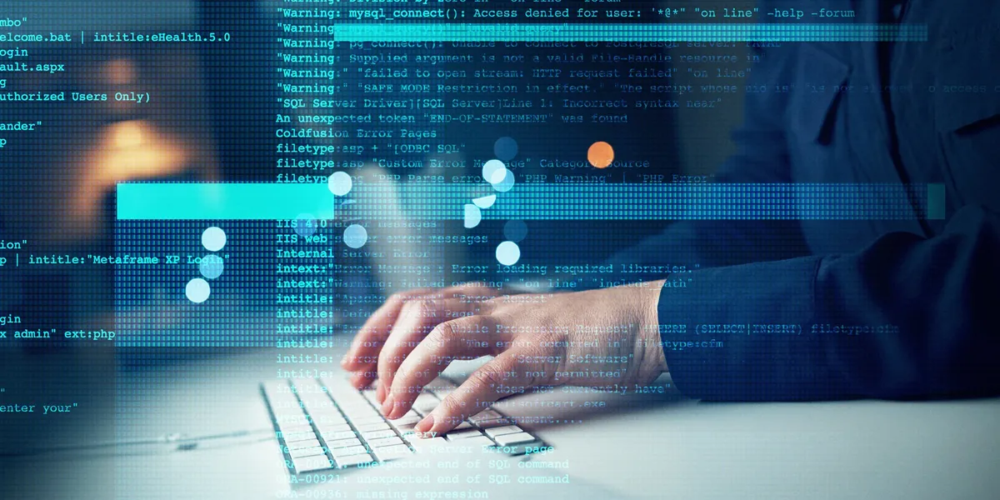

## Where It All Started

My last 2 years of high school was also my starting point for my interest in programming. Aside from the many different data structures and their applications as well as the many other technical aspects of the subject, the creative aspect is what catches my attention the most. Like many people, watching YouTube videos is something I enjoy doing during my free time and one of the many types of videos I enjoy seeing the most are coding projects.

## Inspiration

I'm proud of the many small projects I've done in the past. However, I think it would be cool to make something that a user could interact with outside of an IDE console. For this reason, making a project with a functioning UI is something I hope to learn how to do. Something in particular that motivates me to develop the skills needed for software engineering is seeing games being created from scratch. Seeing how knowledgeable the people who made them are, the many diverse tools they work with, as well as witnessing the overall process are things that I feel inspired by. With the skills I cultivate over time, I hope to develop something that other people can use in their daily life.

## Only The Beginning

Something I look forward to in the future are the software projects I'll be involved with, whether it be for a job or a possible even mini side projects that I'll be doing just for fun. Despite how hard developing these skills may be, I believe the pay out is very valuable. Something I like to think of is the feeling of satisfaction you get after tying up everything and finalizing your project after long, tedious hours of work, especially when you encountered many challenges in between. These aspects of writing code are the reasons I decided to continue on this path in my life. If it wasn't for the time I changed my schedule at the last minute to accommodate "Intro to Computer Science" back in my junior year of high school, I'm not sure where I'd be now. 
