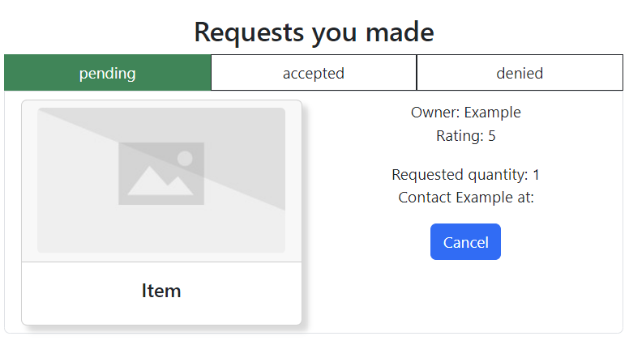

My group's project, "Lendor Vendors", is a web-based application which allows its users to post spare or old items that they don't mind letting others borrow as well as requesting to borrow items from other users. In a way, it is similar to Ebay or any other e-commerce website but instead of selling items, you loan them. Without us realizing it, we've implemented at least a few design patterns in our code since starting our project. Admittedly, I had no idea what design patterns were until just recently. Having just been introduced to this topic, I can't say that I'm an expert on it. However, based on my understanding, design patterns are common ways of creating a solution to the problems that you encounter in your code or in the process of writing it. Additionally, design patterns have shown to be useful in our group project, since a lot of the pages, page components, and database related work share common themes with one another. Below, I will give a couple of examples of the common design patterns found in our code.

## Design Patterns As Seen In Lendor Vendors

One example of the design patterns that are found in our code would be the use of the component-based design. Item cards are components whose purpose is to display the name and image of an item in the gallery page, which displays all of the available items up for borrowing. 

However, we also use them to display items that belong to a specific user on their profile page and in the "requests page", which displays all of the requests that you've made and the requests made for your items. In order to prevent redundant code, the use of the item card component comes in handy.

Another one of the design patterns that we've used is the observer design pattern. To showcase this, I will first talk about the admin role and its capabilities. If a user on our website is an admin, they are granted the ability to remove any of the posted items on the website. To accomplish this, each item card will include a "Delete Post" button that is exclusive only to admins. 

Upon clicking it, a pop up will appear asking you for confirmation, and by clicking "yes", the item will be deleted from the database and will no longer appear in the gallery.

## Final Words

Overall, design patterns are useful solutions to the different problems that arise when starting a project like this one. They allow us to create functionality in our program and simplify our code to make it shorter. Furthermore, they served us as general approaches towards writing code for our components and page files despite how different each of them might be from each other.
