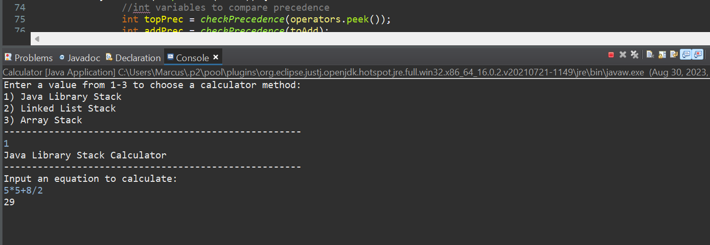

For my ICS 211 class, I wrote code to create a calculator that users can interact with using the console of the IDE (Eclipse). This programs allows you to calculate for equations using addition, subtraction, multiplication, and division. Using a stack or linked list, the program is able to sort the operands and operators in an order which solves the equation inputted by the user while following PEMDAS (except it does not work with parentheses).

When executing the program, the console gives you 2 options: the linked list calculator or the stack calculator. Both options will create 2 linked lists or stacks in order to separate the operators and operands. However, they both essentially work in the same way in terms of the correctness of their calculations. For example, the equation 5x5+4/2 will calculate for 5x5, then 4/2, then add the two results together to get 27.

Overall, this was a fun assignment that I felt was valuable towards understanding how stacks work as well as the many applications they have. Maybe one day I'll find a way to make it work with parentheses. 
