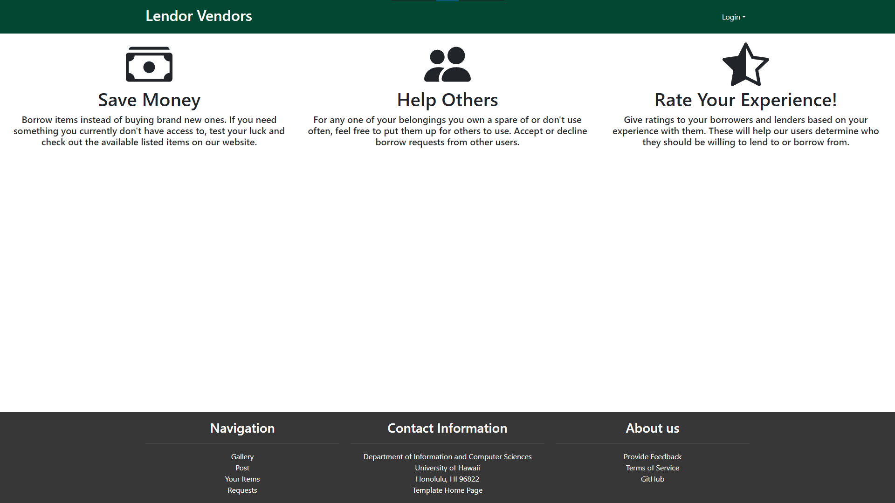
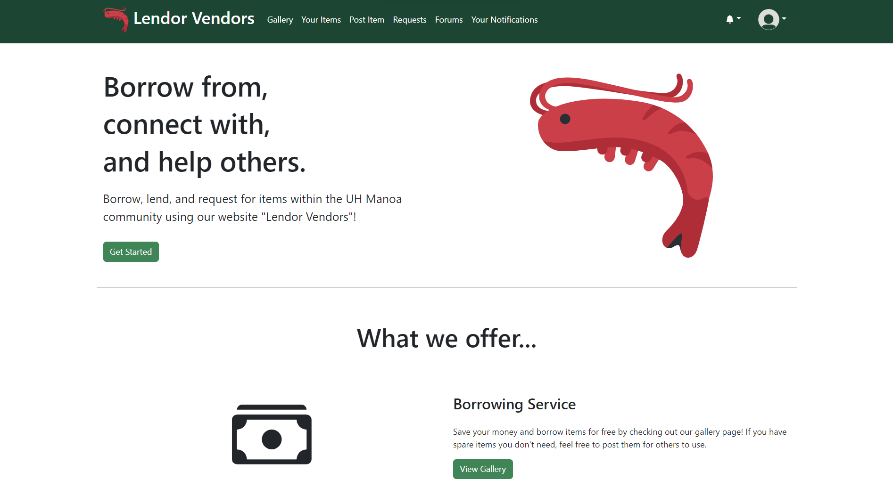
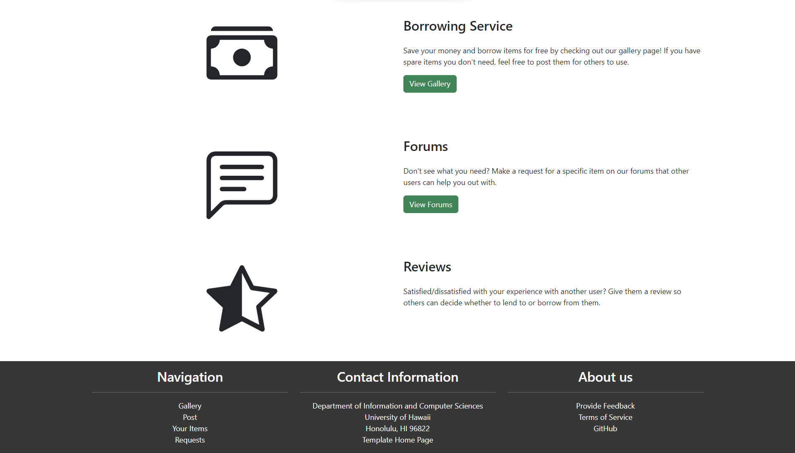
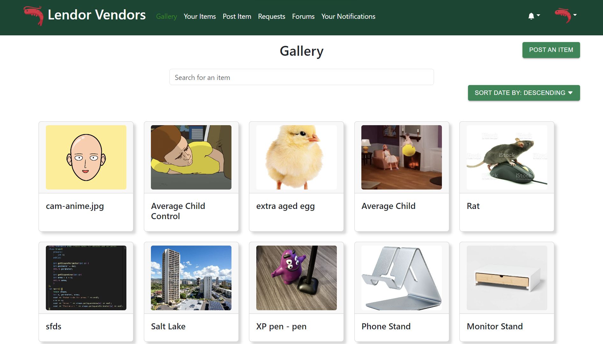
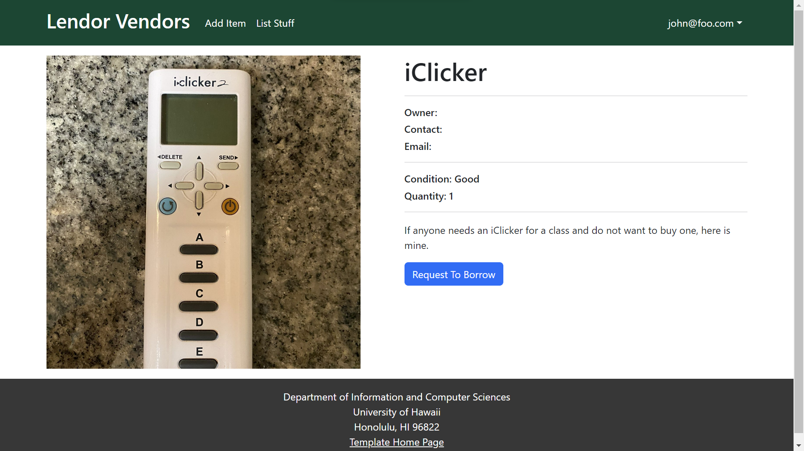
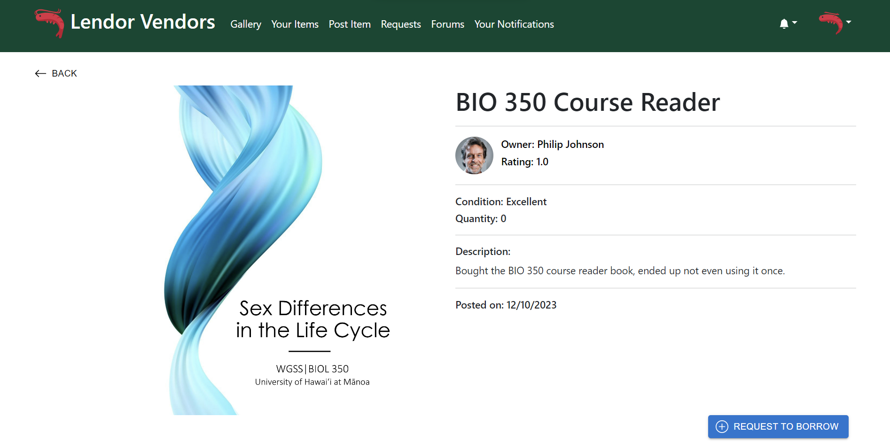
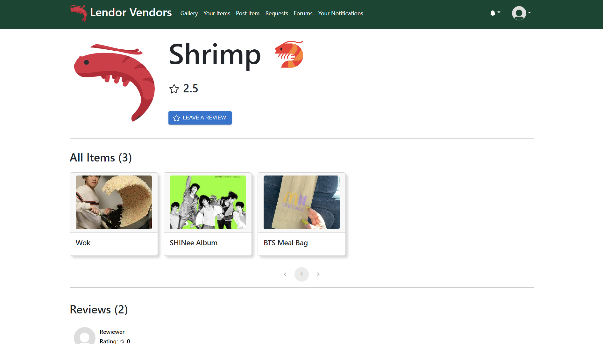
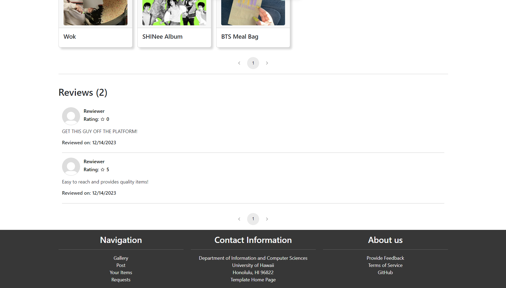

## Introduction

Have you ever been in a situation where you needed something, maybe even temporarily, but didn't want to spend the money? Or maybe you have spare items around the house that you don't have any use for anymore. Those issues are what our web application, "Lendor Vendors" hopes to solve. This project was developed by Jiawen Chen, Truman Choy, Kayla Yanos, and Marcus Prudencio (me). 

With this application, users can put up items for borrowing or become the borrower for already listed items on the site. If you don't see anything you need, there is a forums section where you can request a particular item that other users can help you out with. Additionally, feel free to rate your borrowers and lenders so others can have (or not have) the same experience as you.

## My Contributions

The main contributions I made toward this project include designing and implementing the landing/home, item, and profile pages of the web application. Part of this job was to make the pages visually appealing and user-friendly.

#### Home 

The home page, also referred to as the "landing" page, is the first thing you will see when you access our website. Just like the cover of a book, the way it looks could potentially make or break the interest new users will have of the site. This was the initial design of the home page:

As you can see, it's pretty bland and depending on how large your screen display is, the bottom has a lot of whitespace as seen in the photo above. In fact, some of the feedback we've received mentioned this. To make something that might draw the attention of potential users, I got inspiration from a few popular websites and implemented this final design:

According to both the other team members or those outside of the project group, it did its job. It also fulfills the original intent of informing new users of what our website offers while also giving it a bit of interactive features with the buttons.

#### View-Item Page

In order to find the items that you want to borrow, you can view our gallery page which contains many listed items in the form of "cards". Upon clicking one of the cards, you are redirected to a view-item page that contains additional information such as availability, condition, the person lending it, and a button that redirects you to a request-to-borrow form. The design was inspired by the item pages you can find on e-commerce sites such as eBay and Amazon. The initial implementation (1st picture) was done by me and the additional inclusions and styling adjustments were done by my teammates.

#### Profile Page

The profile page of a user displays their account information as well as the items they're lending out and the reviews made about them. The information you see in the images above come from data fields in our profiles, items, and reviews database collections. To display everything, I made it so each component/section of the page subscribed to the appropriate collection data. The inclusion of the pagination feature, as well as the collections that were necessary to implement this page were made by my other group members.

## Outcome

From this experience, not only have I gotten more comfortable with using the tools required for this class, but I've also learned to better manage my time. Part of this assignment was to estimate how long it would take to finish our assigned issues, time ourselves, and record the finishing time. Given that we had work for other classes as well as an idea on how long it would take to finish our project issues, it was important that we found a good time to do our assigned parts in order to finish before each milestone was due. Because of this, I found myself scheduling out what I had to do for each day in order to allocate time for each of my commitments. Another takeaway from this experience is to use your resources. Admittedly, one of the mistakes I've made at times was creating random adjustments to my code in hopes of fixing a problem I was having. However, different online resources such as ChatGPT have proved to save lots of time.

## Learn More

Check out [https://lendor-vendors.github.io/](https://lendor-vendors.github.io/) for more information about our project. If you want to see more of our project and try it out for yourself, make an account at [lendor-vendors.xyz](https://lendor-vendors.xyz/). Our source code can be found here: [https://github.com/lendor-vendors/lendor-vendors](https://github.com/lendor-vendors/lendor-vendors).

